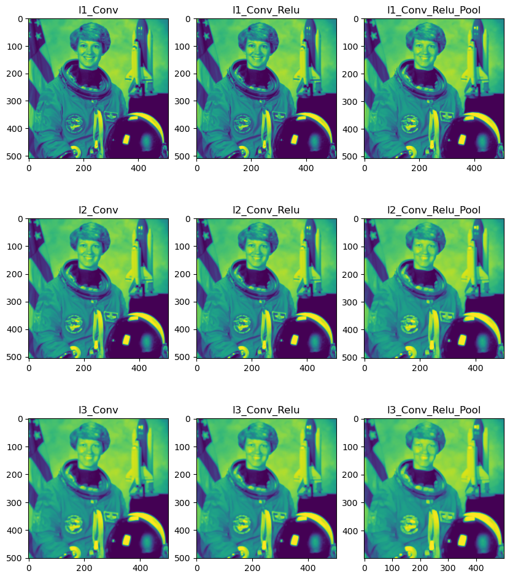

# Building a 2D Convolutional Neural Network using Numpy

*This is an **attempt** to build a convolutional neural network. The network is composed of three layer classes (Convolution, ReLu, and Pooling) and a kernel class. The project idea is based off this article: https://www.kdnuggets.com/2018/04/building-convolutional-neural-network-numpy-scratch.html*

### Class: Kernel
The kernel class takes in a 2D array with a shape of 3*3.

### Class: convLayer
The convLayer class takes in an image as a numpy array and a kernel object, and it does the following:
* Checks for the kernel dimensions, raise errors when kernel size does not fit.
```
def check_kernel(self):
```

* Based on the size of the given image array, it calculates the size of the output feature map based on the formula: <mark>(W−F+2P)/S+1</mark>.
```
xOutput = int(((self.xImgShape - self.xKernShape + 2 * padding) / stride) + 1)
yOutput = int(((self.xImgShape - self.yKernShape + 2 * padding) / stride) + 1)

feature_map = np.zeros((xOutput, yOutput))
``` 

* Add padding to the image array. Padding is default to 0.

* Complete the convolution using the sum of dot products. 
```
feature_map[x, y] = (self.kernel * imgPadded[x: x + self.xKernShape, y: y + self.yKernShape]).sum()
``` 

### Class: reluLayer
Return the original value in the feature map if it is larger than 0.
Otherwise, return 0.
```
output = np.maximum(0, feature_map)
```

### Class: poolingLayer
The poolingLayer takes in a kernel object, a feature map from previous layer, and a pooling method (max pooling or average pooling).
* if the pooling mode is set to "max", the function **selects the maximum** element from the region of the feature map covered by the filter.
* if the pooling mode is set to "mean", the function **calculates the average** from the region of the feature map covered by the filter.

### Compile Layers
The compile_model function takes in the image and three 2D arrays as different kernel sizes.
<br>It runs through layers for three times, each time with the different kernel size. <br>Finally, it outputs the image from each stage.



### Process the Image
The size of the output is set to be a 2D array. So the image has to be transformed into grey before going through the network.
```
img = skimage.data.astronaut()
img = skimage.color.rgb2gray(img)
```

### Final Thoughts
* The project uses kernel and layers to extract features from images; it does not involve any training for classification so it could certainly be extended. 
* I thought my output should be a lot more vague; there might be some hidden issues with how I stack layers.
